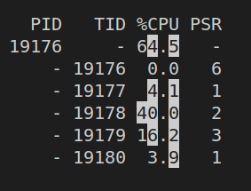

# *rt-dag* DAG launcher

*rt-dag* is an application that, given a certain real-time DAG description, it launches a set of Linux threads (or processes) that represents this DAG including, for instance, the DAG period and end-to-end deadline. 

# What does it do ?

Part of the realtime community uses workloads modeled as DAGs. However, it's not easy to find benchmarks and applications to evaluate the research proposals on top of actual Linux OS and hardware platforms. Sometimes the design team has traces of individual tasks, but not for the entire DAG. In those situations, this application could be used to do some preliminary integration of tasks of a DAG to check the overall system performance parameters.

This application can be used together with a *random graph generator* or *traces of an actual application* to quickly model a DAG application, with some dummy computation (i.e. busy loop) and actual communication. Thus, this DAG can be used:
  - to check whether the current OS setup can deliver the DAG timing requirements;
  - to check the OS response times under a certain DAG workload. For instance, it's possible to quickly tweak the WCET of individual tasks to see its impact on the DAG end-to-end deadline. This can be used to decide in which task is more interesting to focus for WCET optimizations;
  - to check computing/communication/IO bottlenecks: can be accomplished in combination with standard [Linux performance monitoring tools](https://www.tecmint.com/command-line-tools-to-monitor-linux-performance/); 
  - to check for memory *collision* in the cache: can be accomplished in combination with [perf](https://www.brendangregg.com/perf.html);
  - to check whether the workload is within the power budget (TO BE DONE!);
  - to check if the DAG end-to-end deadline is respected (DONE!).

# How does it work ?

The user describes a certain real-time DAG (see [dag.h](./dag.h) or [minimal.yaml](./minimal.yaml) for an example) which represents a parallel workload and this application launches this DAG app, mimicking its actual computation and communication requirements of each task.

The *main* function works as a task launcher that creates **threads(or processes)** to run the tasks and creates the **thread-safe queues (or POSIX named shared memory)** to represent the edges of the DAG. This queue is created for every edge.  Each edge has one sender/receiver pair; the source task is the only one that writes in the queue, while the target task is the only one that reads from the queue. A multicast-like communication has to be broken down into multiple queues. A queue is named by combining the names of the source and target tasks. For instance, an mq named *n0_n1* connects the tasks *n0* and *n1*. 

***TO REVIEW***

This app currently supports end-to-end DAG deadline checking. This is implemented with POSIX shared memory (shmget and shmat) among the start and the final tasks. Basically, every time the start task starts a new DAG iteration, it saves its start time with *clock_gettime CLOCK_MONOTONIC_RAW* in the shared memory address. The final task computes its current time and subtracts from the time in the shared variable. Since DAG_DEADLINE is lower or equal to the DAG_DEADLINE, there is no risk of synchronization issues among the start and final tasks. This approach has limitations mentioned in the TODO list. 

## DAG description

*rt-dag* supports two input formats: dag.h or yaml.

For example, a DAG like this one:
```
      n1
     /   \
  n0      n3
     \   /
      n2 
```

can be described as C header file:

```C++
#ifndef DAG_H_
#define DAG_H_

// global defs
const char * dagset_name = "minimal_header";
#define N_TASKS 4
#define N_EDGES 4
#define N_CPUS 8
#define MAX_OUT_EDGES_PER_TASK 2
#define MAX_IN_EDGES_PER_TASK 2
#define MAX_MSG_LEN 64
#define REPETITIONS 50 // the number of iterations of the complete DAG
#define DAG_PERIOD 300'000 // in us 
#define DAG_DEADLINE DAG_PERIOD // usually is the same as dag period, but not necessarly
const char * tasks_name[N_TASKS] = {"n0","n1","n2","n3"};
// The actual task computation workload in 'ticks'. a tick is equivalent to a simple logic operation.
// Note that tick is not time ! it's a kind of workload unit
const unsigned tasks_wcet[N_TASKS] = {50'000,50'000,50'000,50'000}; // in ticks. 
// The relative deadline of each task.
// make sure that the sum of the longest path must be <= DAG_DEADLINE since
// this consistency is not done here !!!
const unsigned tasks_rel_deadline[N_TASKS] = {100'000,100'000,100'000,100'000}; // in us
// pin threads/processes onto the specified cores
// the values are the cpu ids. mask is currently not supported
const unsigned task_affinity[N_TASKS] = {1,2,3,1};
// set the frequency of each core, in MHz
const unsigned cpus_freq[N_CPUS] = {1000,1000,1000,1000,200,200,200,200};
// values != 0 means there is a link from task l (line) to task c(column)
// amount of bytes sent byeach edge
const unsigned adjacency_matrix[N_TASKS][N_TASKS] = {
    {0,30,50, 0},
    {0, 0, 0,32},
    {0, 0, 0,52},
    {0, 0, 0, 0},
};
#endif // DAG_H_
```

or as YAML format:

```yaml
dag_name: "minimal_yaml"
n_tasks: 4
n_edges: 4
n_cpus: 8
max_out_edges: 2
max_in_edges:  2
max_msg_len: 1
repetitions: 50 # the number of iterations of the complete DAG
dag_period: 300000 # in us
dag_deadline: 300000 # in us
hyperperiod: 300000 # in us
tasks_name: ["n000","n001","n002","n003"]
# The actual task computation time is decided randomly in runtime
tasks_wcet: [50000,50000,50000,50000] # in us. 
# The relative deadline of each task.
# make sure that the sum of the longest path must be <= DAG_DEADLINE since
# this consistency is not done here !!!
tasks_rel_deadline: [100000,100000,100000,100000] # in us. 
# pin threads/processes onto the specified cores
tasks_affinity: [1,2,2,4]
# set the frequency of each core, in MHz
cpus_freq: [1000,1000,1000,1000,200,200,200,200]
# values != 0 means there is a link from task l (line) to task c(column)
# amount of bytes sent by each edge
adjacency_matrix: [
                     [0,30,50, 0],
                     [0, 0, 0,32],
                     [0, 0, 0,32],
                     [0, 0, 0, 0],
                  ]
```

## Usage example


This example above, when running on a ODROID-XU4 board, gives the following results when the little island set to 500MHz:

```
...
task n0 (47): task duration 518 us
task n2 (47): task duration 1595 us
task n1 (47): task duration 4137 us
task n3 (47): task duration 399 us
task n3 (47): dag  duration 5123 us

task n0 (48): task duration 453 us
task n2 (48): task duration 1649 us
task n1 (48): task duration 4141 us
task n3 (48): task duration 399 us
task n3 (48): dag  duration 5060 us

task n0 (49): task duration 511 us
task n2 (49): task duration 1595 us
task n1 (49): task duration 4202 us
task n3 (49): task duration 400 us
task n3 (49): dag  duration 5192 us
```

and when the little island set to 200MHz:

```
...
task n0 (0): task duration 1197 us
ERROR: task n0 (0): task duration 1197 > deadline 1000!
task n2 (0): task duration 4121 us
task n1 (0): task duration 10626 us
ERROR: task n1 (0): task duration 10626 > deadline 8000!
task n3 (0): task duration 999 us
task n3 (0): dag  duration 15600 us

ERROR: dag deadline violation detected in iteration 0. duration 15600 us
rt_dag:  Assertion `duration <= DAG_DEADLINE' failed.
```

Summarizing the results, with avarege results

|     | at 500Mhz | at 200Mhz |
|-----|----------:|----------:|
| n0  |     500us |    1200us |
| n1  |    4100us |   10400us |
| n2  |    1500us |    4100us |
| n3  |     400us |    1000us |
| dag |    5100us |   12900us |

When running at 500Mhz, there was no relative or end-to-end deadline violation.
However, when running at 200Mhz, tasks n0 and n1 missed their relative deadlines. n3 almost missed its relative deadline. The application aborted because the end-to-end deadline was also missed. It took 15600 us but the deadline is 10000 us.

# How to compile

## Requirements

 - sudo apt install cpufrequtils
 - sudo apt install libyaml-cpp-dev; only required when using the YAML mode.

## Compiling

```
$> mkdir build; cd build
$> cmake ..
$> make -j 6
```

## Compilation parameters

One can change the compilation parameters with *ccmake*:

  - The parameter **TASK_IMPL** indicates whether the DAG is implemented with threads or processes. The default value is threads;
  - The parameter **INPUT_TYPE** selects input format: C header file or yaml. The default is yaml;
  - The parameter **LOG_LEVEL** can be used to change verbosity. The default value is 0, i.e. the lowest verbosity;
  - The parameter **BUFFER_LINES** indicated the buffer depth os each DAG edge. It represents how many messages can be stores before the *push* method is blocked.

# How to run

*rt-dag* internally sets the affinity and the kernel scheduling parameters
for SCHED_DEADLINE. In order to have it working, it's necessary to disable kernel admission control by running this command on the target board:

```
sudo su
echo -1 > /proc/sys/kernel/sched_rt_runtime_us
```

Next, proceed with the actual execution:

```
$> sudo ./rt_dag
SEED: 123456
n0, 50000
 ins: 
 outs: n0_n1(30), n0_n2(50), 
n1, 500000
 ins: n0_n1(30), 
 outs: n1_n3(32), 
n2, 200000
 ins: n0_n2(50), 
 outs: n2_n3(52), 
n3, 50000
 ins: n1_n3(32), n2_n3(52), 
 outs: 
Task n0 pid 30999 forked
Task n1 pid 31000 forked
Task n2 pid 31001 forked
Task n3 pid 31002 forked
task n0 (0): task duration 52477 us
task n0 (0): task duration 52477 > wcet 50000!
task n2 (0): task duration 159263 us
task n1 (0): task duration 397947 us
task n3 (0): task duration 39881 us
task n3 (0): dag  duration 477777 us

task n0 (1): task duration 39803 us
task n2 (1): task duration 159123 us
task n1 (1): task duration 398015 us
task n3 (1): task duration 39842 us
task n3 (1): dag  duration 477754 us

task n0 (2): task duration 39887 us
task n2 (2): task duration 159198 us
task n1 (2): task duration 397777 us
task n3 (2): task duration 39748 us
task n3 (2): dag  duration 477465 us

task n0 (3): task duration 39793 us
task n2 (3): task duration 159193 us
task n1 (3): task duration 397853 us
task n3 (3): task duration 39731 us
task n3 (3): dag  duration 477476 us

task n0 (4): task duration 39761 us
task n2 (4): task duration 159363 us
task n1 (4): task duration 397946 us
task n3 (4): task duration 39762 us
task n3 (4): dag  duration 477557 us

Task n1 pid 31000 killed
Task n2 pid 31001 killed
Task n3 pid 31002 killed
Task n0 pid 30999 killed
```

The number in parenthesis represents the iteration. Note that, since the tasks are parallel processes, the iteration order when logging can be a bit mixed up. Note also that the 1st task is the only periodic task in the DAG, following the DAG_PERIOD attribute. The execution time of all tasks starts as soon as they receive all required inputs and ends once they have sent all messages. In other words, the *task duration* accounts for the task computation plus its messages sent. It does not account for the waiting time for incoming messages since they are suspended. The *dag duration* represents the sum of execution times of the DAG critical path.

In YAML mode, it needs to YAML input file as argument
```
$> sudo ./rt_dag <yaml_file>
```

# Main features

## DAG deadline checking

Both the task relative deadline and the DAG end-to-end deadline are checked during execution.
The former only prints a warning message while the later interrupts the application.

## Task affinity

To check the CPU running each task, run in a separate terminal:

```
$> watch -tdn0.5 ps -mo pid,tid,%cpu,psr -p \`pgrep rt_dag\`
```

Generating an output similar to this one:



## SCHED_DEADLINE

As a default configuration, Linux wont allow to set SCHED_DEADLINE on tasks with affinity constraints.
To enable it, it is required to run this command before running *rt-dag*:

```
echo -1 | sudo tee /proc/sys/kernel/sched_rt_runtime_us
```

*rt-dag* uses the task definitions found in the input file to set SCHED_DEADLINE parameters. This can be checked by running:

```
$> chrt -p <PID>
pid <PID>'s current scheduling policy: SCHED_DEADLINE
pid <PID>'s current scheduling priority: 0
pid <PID>'s current runtime/deadline/period parameters: 50000/100000/100000
```

## Setting the CPU frequency

Run the following commands in different terminals of the target platform:

```
watch cat /sys/devices/system/cpu/cpu*/cpufreq/scaling_governor
watch cat /sys/devices/system/cpu/cpu*/cpufreq/scaling_cur_freq
```

Then check whether the governor is set to *userspace* and the frequency is in accordance with the system definition.

# Design decisions

This application is not an *one-size fits all* solution for modeling DAG-like applications due to the complexities of application-level requirements and different ways to implement it. So, this section briefly explains the mindset behind the decision-making process. 

The main design decision were:
 1. *process-level vs thread-level for task modeling*:
 2. *which IPC to use*:
 3. ....

## Process-level vs thread-level for task modeling

 - modeling tasks as OS processes by using *fork()*. 
   - Once the process is forked, there is no implicit shared memory anymore, requiring explicit communication to transfer data among tasks.
   - Support message passing (i.e. sockets or POSIX message queue) or byte streams (e.g. FIFO, pipes) for explicit communication
   - Shared memory is still possible, but with explicit declarations like POSIX shared memory (.e.g *shm_open()*)
   - Possible to evolve from UMA/NUMA shared memory computer arch to a NORMA-based distributed computing
 - modeling tasks as threads by using *pthread_create()*.
   - Very efficient for shared memory computer arch
   - Limited to shared memory IPC strategies

## Selecting IPC for task communication

The IPC/Sync considered for process-based task modeling: 
 - Message-based data transfer: creates a system call but has built-in synchronization. POSIX message queue. This option was not implemented;
 - Shared-memory comm: has no system call, but requires the programmer to implement the synchronization (e.g. semaphore). E.g.: POSIX shared memory. This was the chosen method;
 - Synchronization: POSIX name semaphores are used to sync the processes.

The IPC/Sync used for thread-based task modeling: 
 - shared memory;
 - Synchronization: C++ mutex and condition_variable.

The IPC for process and for threads are implemented in [circular_buffer.h](./include/circular_buffer.h) and [circular_shm.h](./include/circular_shm.h). The message sent on the edges is implemented in [shared_mem_type.h](./include/shared_mem_type.h).

For more background information, please check Chapter 43: Interprocess Communication Overview, from [The Linux programming interface: a Linux and UNIX system programming handbook](https://www.oreilly.com/library/view/the-linux-programming/9781593272203/), by Michael Kerrisk.

# Comparison with other tools

 - [rt-app](https://github.com/scheduler-tools/rt-app), as defined by the authors, is a test application that starts multiple periodic threads in order to simulate a real-time periodic load.

 - *cyclictest* is for testing the OS response time under a certain task set of periodic real-time tasks modeled as [fixed priorities tasks](https://wiki.linuxfoundation.org/realtime/documentation/howto/tools/cyclictest/start) or [deadline-based tasks](https://man.archlinux.org/man/community/rt-tests/cyclicdeadline.8.en).

I hope that, in the future, *rt-dag* could do something similar, but the task set being modeled as a DAG, with it's intrinsic task dependencies. 

## Using perf and hotspot

Install perf

```
$ sudo apt install linux-tools-$(uname -r) linux-tools-generic
```

Download [hotspot](https://github.com/KDAB/hotspot/releases/tag/v1.3.0)  


```
$ sudo perf record -o ./perf.data --call-graph dwarf -e 'sched:*' -- app
```

load the perf.dat file into hotspot.

# FAQ

 1. why not use middlewares like DDS, ROS, OpenMP, etc ? 
   - These could be future updates, but be aware that they usually have internal scheduling policies on top of the OS scheduling that could complicate realtime analyses. As an initial step, to simplify things, we want to support Linux OS-only resources, with no external dependencies. 
 2. ... 

# References

 - [The Linux programming interface: a Linux and UNIX system programming handbook](https://www.oreilly.com/library/view/the-linux-programming/9781593272203/);
 - [Beej's Guide to Unix IPC](https://beej.us/guide/bgipc/html/single/bgipc.html).

# TODO

 - [x] The amount of data sent in the messages still don't correspond to the DAG description;
 - [x] It seems to have some sync issue among the tasks. A temporary hack is to put some sleeps when the tasks are spawned;
 - [x] Implement thread-level task modeling;
 - [x] Implement shared-memory IPC strategy;
 - [X] Implement end-to-end deadline checking;
 - [X] Set SCHED_DEADLINE;
 - [X] Extend the data structure to pin down a task to a core;
    - [X] Pin down a task to a core is not working in process mode;
    - [ ] Support affinity masks in the task_affinity vector
 - [ ] Extend the data structure to set the frequency of the islands;
 - [ ] Check the power budget.

## Authors

 - Alexandre Amory (June 2022), [Real-Time Systems Laboratory (ReTiS Lab)](https://retis.santannapisa.it/), [Scuola Superiore Sant'Anna (SSSA)](https://www.santannapisa.it/), Pisa, Italy.

## Funding
 
This software package has been developed in the context of the [AMPERE project](https://ampere-euproject.eu/). This project has received funding from the European Union’s Horizon 2020 research and innovation programme under grant agreement No 871669.
